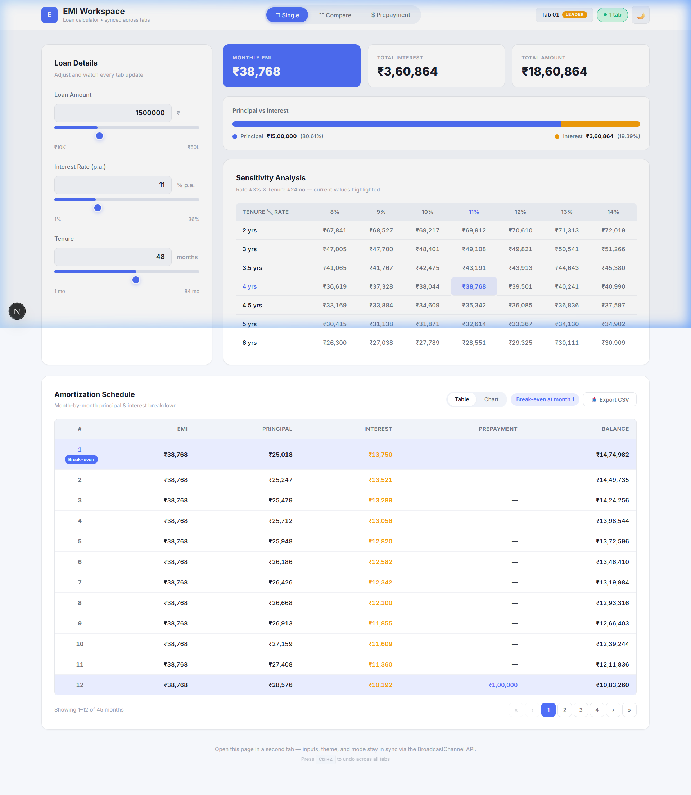
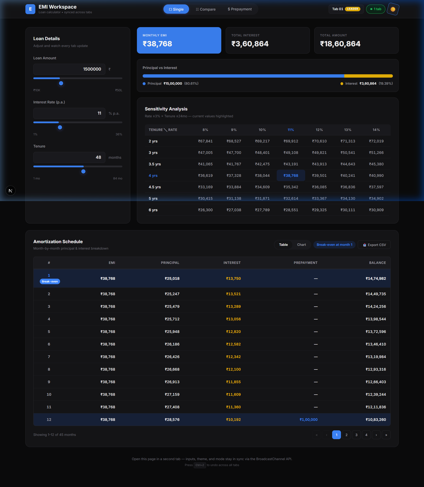
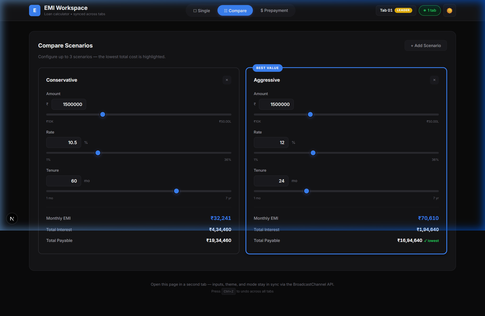
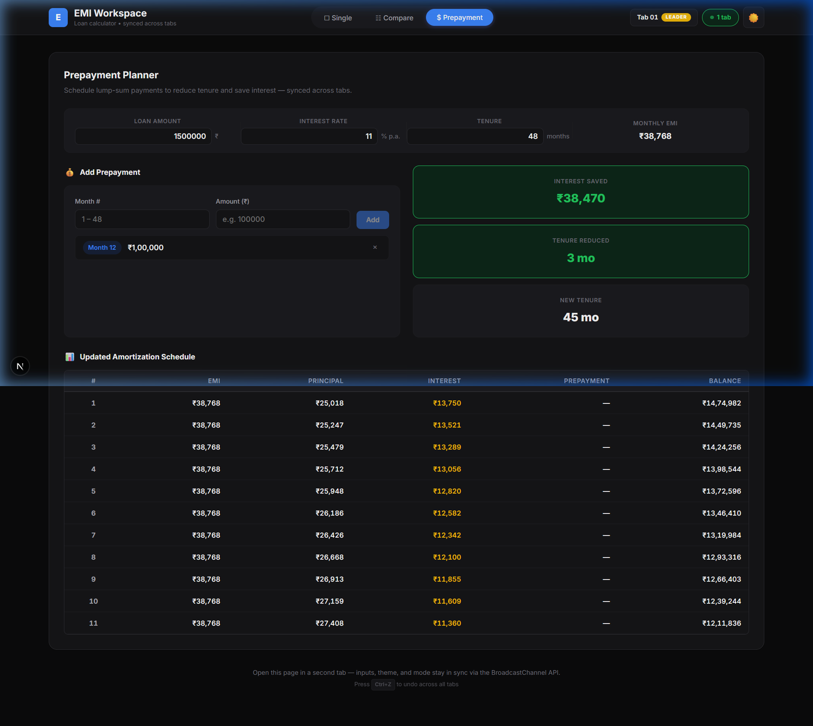

# 🏦 EMI Workspace — Loan EMI Calculator with Shared Workspace

> A real-time collaborative Loan EMI Calculator where **every change syncs instantly across all open browser tabs** — powered by the BroadcastChannel API. No server. No polling. No localStorage hacks. Pure client-side magic.

<p align="center">
  <a href="YOUR_DEPLOYED_LINK_HERE"><strong>🚀 Live Demo →</strong></a>
</p>

<p align="center">
  
  
  
  
  
  
</p>

---

## Table of Contents

- [Why This Project Stands Out](#-why-this-project-stands-out)
- [Features at a Glance](#-features-at-a-glance)
- [Tech Stack](#-tech-stack)
- [Quick Start](#-quick-start)
- [Architecture Deep-Dive](#-architecture-deep-dive)
  - [Cross-Tab Sync via BroadcastChannel](#cross-tab-sync-via-broadcastchannel)
  - [Tab Presence & Leader Election](#tab-presence--leader-election)
  - [State Management Flow](#state-management-flow)
- [Features in Detail](#-features-in-detail)
  - [EMI Calculator](#1-emi-calculator)
  - [Amortization Schedule](#2-amortization-schedule)
  - [Sensitivity Analysis](#3-sensitivity-analysis)
  - [Compare Scenarios](#4-compare-scenarios)
  - [Prepayment Planner](#5-prepayment-planner)
  - [Cross-Tab Sync](#6-cross-tab-sync)
  - [Tab Identity & Activity Indicator](#7-tab-identity--activity-indicator)
- [EMI Formula & Financial Math](#-emi-formula--financial-math)
- [Technical Challenges & Solutions](#-technical-challenges--solutions)
- [Edge Cases Handled](#-edge-cases-handled)
- [URL State & Shareability](#-url-state--shareability)
- [Theming](#-theming)
- [Project Structure](#-project-structure)
- [Browser Compatibility](#-browser-compatibility)
- [Design Decisions](DESIGN_DECISIONS.md)
- [Screenshots](#-screenshots)
- [License](#-license)

---

## 🏆 Why This Project Stands Out

| Dimension | What I Built |
|-----------|-------------|
| **Cross-Tab Sync** | Real-time state sync across unlimited browser tabs using BroadcastChannel API — not localStorage events, not polling, not a server |
| **Tab Awareness** | Each tab has a unique identity, live tab count, and automatic leader election — all via message-passing (no heartbeats) |
| **Undo Across Tabs** | `Ctrl+Z` undoes the last change simultaneously across every open tab, with debounced history to handle slider drags |
| **Zero External State Libraries** | No Redux, no Zustand, no Jotai — custom hooks handle everything in ~230 lines |
| **Zero CSS Frameworks** | No Tailwind, no Bootstrap — vanilla CSS Modules + CSS Custom Properties for a polished, theme-aware UI |
| **Production-Grade Edge Cases** | Floating-point rounding, prepayment > balance capping, SSR hydration fixes, background tab throttling workarounds |

---

## ✨ Features at a Glance

| Feature | Description |
|---------|-------------|
| 📊 **EMI Calculator** | Reducing-balance EMI with dual-input controls (sliders + numeric fields) |
| 📅 **Amortization Schedule** | Month-by-month table with pagination, break-even detection, chart toggle, and CSV export |
| 🔍 **Sensitivity Analysis** | Rate ±3% × Tenure ±24mo interactive matrix with current-value highlighting |
| ⚖️ **Compare Scenarios** | Side-by-side comparison of up to 3 loan configurations with visual breakdowns |
| 💰 **Prepayment Planner** | Schedule lump-sum prepayments → see interest saved, tenure reduced, updated amortization |
| 🔄 **Cross-Tab Sync** | All state syncs across browser tabs in real-time via BroadcastChannel API |
| 🏷️ **Tab Identity** | Unique tab ID, live tab count, leader election badge |
| ↩️ **Undo (Ctrl+Z)** | Undo last change across all tabs simultaneously (debounced for slider drags) |
| 🌗 **Dark / Light Theme** | Premium dark mode with curated palette, synced across all tabs |
| 🔗 **URL State** | Shareable URLs with loan params encoded as query parameters |

---

## 🛠 Tech Stack

| Layer | Technology | Why |
|-------|-----------|-----|
| Framework | **Next.js 16** (App Router) | Latest React Server Components architecture |
| UI Library | **React 19** | Concurrent features, improved hydration |
| Styling | **Vanilla CSS** (CSS Modules + Custom Properties) | Zero-framework, runtime theme switching without JS re-renders |
| Charts | **Recharts 3** | Declarative, composable charting for React |
| Typography | **Inter** (Google Fonts) | Clean, modern, highly readable |
| Cross-Tab Sync | **BroadcastChannel API** | Browser-native pub/sub — instant, zero-storage |
| State Persistence | **URL query parameters** | Shareable loan configurations |

> **Zero backend. Zero external state libraries. Zero CSS frameworks.** Every feature is built from scratch with browser-native APIs.

---

## 🚀 Quick Start

### Prerequisites

- **Node.js** ≥ 18.x  
- **npm** ≥ 9.x

### Installation & Run

```bash
# Clone the repository
git clone https://github.com/your-username/emi-calculator.git
cd emi-calculator/emi-calculator

# Install dependencies
npm install

# Start development server
npm run dev
```

Open [http://localhost:3000](http://localhost:3000) in your browser.  
**Open a second tab** to see cross-tab sync in action.

### Production Build

```bash
npm run build
npm start
```

---

## 🏗 Architecture Deep-Dive

### Cross-Tab Sync via BroadcastChannel

All state synchronization uses the **BroadcastChannel API** — a browser-native pub/sub mechanism for same-origin tabs. Three dedicated channels isolate concerns:

```
┌─────────────────────────────────────────────────────────────────┐
│                    BroadcastChannel Architecture                │
├─────────────────────────────────────────────────────────────────┤
│                                                                 │
│   Tab A                                             Tab B       │
│   ┌──────────┐     emi-calculator-sync     ┌──────────┐        │
│   │          │ ◄══════════════════════════► │          │        │
│   │  React   │     emi-undo-sync           │  React   │        │
│   │  State   │ ◄══════════════════════════► │  State   │        │
│   │          │     emi-theme-sync           │          │        │
│   │          │ ◄══════════════════════════► │          │        │
│   └──────────┘                             └──────────┘        │
│                                                                 │
│   Channel 1: State sync (inputs, scenarios, prepayments)       │
│   Channel 2: Undo sync  (separate to avoid infinite loops)     │
│   Channel 3: Theme sync (decoupled from app state)             │
└─────────────────────────────────────────────────────────────────┘
```

**Key design decisions:**
- **No localStorage event hacks** — BroadcastChannel is the sole sync mechanism
- **No server** — everything runs client-side
- **No polling** — no `setInterval` for state synchronization
- **Dedicated undo channel** — prevents infinite broadcast loops when undoing
- **Separate theme channel** — theme changes don't trigger state re-renders

> Implementation: [`useSharedState.js`](hooks/useSharedState.js)

### Tab Presence & Leader Election

Tab presence is managed **purely via BroadcastChannel** message passing — no localStorage, no heartbeats, no timeouts.

```
Tab opens  → broadcasts ROLL_CALL  → existing tabs respond with PRESENT
Tab closes → broadcasts TAB_CLOSE  → other tabs remove it from their in-memory map
```

- **Tab count** = size of each tab's in-memory peer map
- **Leader** = tab with the earliest `createdAt` timestamp (deterministic, no negotiation)
- **Tab ID** = sequential numbering based on `createdAt` order (e.g., Tab 01, Tab 02)

> Why not heartbeats? Browsers **throttle `setInterval` in background tabs** to ~1/minute. A 5-second timeout would falsely drop background tabs. Our approach has zero false positives.

> Implementation: [`useTabPresence.js`](hooks/useTabPresence.js)

### State Management Flow

```
page.js (orchestrator)
  │
  ├── useSharedState(DEFAULT_STATE)  →  { loanAmount, interestRate, tenure, activeTab, scenarios, prepayments }
  ├── useSharedTheme()               →  { theme, toggleTheme }
  └── useTabPresence()               →  { tabId, tabCount, isLeader }
  │
  ├── Calculator Tab   →  LoanInputs + Summary + SensitivityTable + AmortizationSchedule
  ├── Compare Tab      →  CompareScenarios
  └── Prepayment Tab   →  PrepaymentPlanner
```

State flows **down** via props. Updates flow **up** via callback props. Cross-tab broadcast is automatic and transparent.

---

## 📋 Features in Detail

### 1. EMI Calculator

The core calculator with three inputs:
- **Loan Amount** (₹10,000 – ₹50,00,000) — slider + numeric input
- **Interest Rate** (1% – 36% p.a.) — slider + numeric input
- **Tenure** (1 – 84 months) — slider + numeric input

Outputs:
- Monthly EMI
- Total payable amount
- Total interest
- Principal vs Interest ratio bar

### 2. Amortization Schedule

Month-by-month breakdown showing:
- EMI, Principal paid, Interest paid, Prepayment, Balance remaining
- **Break-even month** detection (where cumulative principal > cumulative interest)
- **Pagination** (12 rows per page)
- **Chart view** toggle (stacked bar chart via Recharts)
- **CSV export** button
- **Prepayment integration** — prepayments from the Prepayment Planner are reflected here

### 3. Sensitivity Analysis

A Rate × Tenure matrix showing EMI for:
- Rate: current ±1%, ±2%, ±3% (clamped to 1–36%)
- Tenure: current ±6, ±12, ±24 months (clamped to 1–84 months)
- Current values highlighted in the grid
- Grid **gracefully shrinks** at edges via clamping + deduplication

### 4. Compare Scenarios

Side-by-side comparison of up to 3 loan scenarios:
- Add/remove scenarios
- Edit each scenario's amount, rate, and tenure independently
- Auto-calculated EMI, total interest, total payable for each
- **Lowest total payable** badge
- Synced across all open tabs

### 5. Prepayment Planner

Schedule one-time lump-sum prepayments:
- Editable loan parameters (synced with main calculator)
- Add prepayments with month number and amount
- Real-time savings calculation:
  - Interest saved vs original plan
  - Tenure reduced (months)
  - New (shorter) tenure
- Full updated amortization schedule with prepayments applied

**Strategy:** Reduce-tenure — EMI stays fixed, prepayment is applied to principal, loan finishes sooner.

**Edge cases handled:**
- Prepayment > outstanding balance → capped at remaining balance
- Prepayment month beyond tenure → validated
- Multiple prepayments in same month → summed

### 6. Cross-Tab Sync

Everything syncs across tabs in real-time:
- Calculator inputs (amount, rate, tenure)
- Scenarios in compare mode
- Prepayments
- Active tab/mode
- Theme (dark/light)

### 7. Tab Identity & Activity Indicator

- Each tab displays a unique ID (Tab 01, Tab 02, etc.)
- Live count of currently open tabs
- Leader badge on the oldest tab
- Count updates instantly when tabs open or close

---

## 📐 EMI Formula & Financial Math

### Standard Reducing-Balance EMI

```
EMI = P × r × (1 + r)^n / ((1 + r)^n - 1)

Where:
  P = Principal (loan amount)
  r = Monthly interest rate (annual rate / 12 / 100)
  n = Tenure in months
```

### Amortization (per month)

```
Interest  = Outstanding Balance × Monthly Rate
Principal = EMI - Interest
Balance   = Balance - Principal
```

### Prepayment (reduce-tenure strategy)

```
At prepayment month:
  Balance = Balance - Prepayment Amount  (clamped to ≥ 0)
  
Then continue normal amortization with the same fixed EMI.
The loan finishes sooner because the balance is now smaller.

Interest Saved = Total Interest (original) - Total Interest (with prepayment)
Tenure Reduced = Original tenure - Actual tenure after prepayment
```

---

## 🧩 Technical Challenges & Solutions

### 1. Browser Throttling Kills Background Tab Heartbeats

**Problem:** Initial implementation used heartbeat + timeout for tab presence. Browsers throttle `setInterval` in background tabs to ~1/min. With a 5-second timeout, background tabs were falsely marked as "dead" — tab count dropped incorrectly.

**Solution:** Abandoned heartbeat entirely. Switched to a pure **BroadcastChannel message-passing** protocol: `ROLL_CALL` → `PRESENT` → `TAB_CLOSE`. Background tabs are never dropped because there's nothing to expire.

### 2. Slider Drags Flooding the Undo Stack

**Problem:** Dragging a slider from 10% to 15% fires `onChange` ~50 times. Without debouncing, Ctrl+Z would require 50 presses to undo one drag.

**Solution:** Undo history pushes are **debounced by 500ms**. Only the final resting value of a slider drag is recorded. State broadcast and UI updates remain instant — only the undo stack push is deferred.

### 3. SSR/CSR Hydration Mismatch for Tab IDs

**Problem:** `useTabPresence` generates a unique tab ID using `Date.now()` + `Math.random()`. During SSR, these values differ from CSR, causing React hydration warnings.

**Solution:** Tab ID defaults to a static `'Tab 01'` during SSR. The real ID is generated inside a `useEffect` (client-only). `suppressHydrationWarning` is set on `<html>` for the theme attribute.

### 4. Undo Broadcast Creating Infinite Loops

**Problem:** Pressing Ctrl+Z broadcasts the undone state via the state channel. Other tabs receive it as a normal `STATE_UPDATE`, pushing it back into the undo history — creating a loop.

**Solution:** Undo uses a **dedicated `emi-undo-sync` channel**, separate from the state channel. Other tabs apply the undone state without pushing it to their undo stack. The two channels have completely separate responsibilities.

### 5. Last-Month Amortization Rounding Error

**Problem:** Due to `Math.round()` on monthly interest, the cumulative principal + interest doesn't always exactly equal the loan amount. The final month's balance might be -₹3 or +₹3.

**Solution:** The last month explicitly sets `principalPaid = remaining balance`, ensuring the loan closes to exactly ₹0. The EMI for the final month is adjusted accordingly.

> 📄 For the full list of trade-off analyses, see [DESIGN_DECISIONS.md](DESIGN_DECISIONS.md)

---

## 🛡 Edge Cases Handled

| Edge Case | Handling |
|-----------|---------|
| Loan amount = 0 or negative | Returns EMI = 0, empty schedule |
| Interest rate = 0 | Returns EMI = 0 (division by zero guarded) |
| Tenure = 0 | Returns empty schedule |
| Last month rounding | Principal adjusted so balance reaches exactly ₹0 |
| Prepayment > balance | Capped at remaining balance, loan closed |
| Prepayment month > tenure | Ignored during calculation |
| Multiple prepayments same month | Amounts summed |
| BroadcastChannel unavailable | App works in single-tab mode (graceful degradation) |
| SSR hydration | Tab ID defaults to "Tab 01" on server, resolved on client |

---

## 🔗 URL State & Shareability

Loan parameters are encoded in the URL as query parameters:

```
https://your-deployed-url.vercel.app/?amount=1500000&rate=11&tenure=48
```

- Parameters are read on page load and kept in sync with app state
- URL updates are **debounced** (300ms) to avoid flooding browser history during slider drags
- Uses `replaceState` (not `pushState`) to keep the back button clean
- Share a specific loan configuration by simply sharing the URL

---

## 🎨 Theming

Two professionally crafted themes with full CSS Custom Property support:

| Theme | Palette |
|-------|---------|
| **Light** | White backgrounds, blue accents, clean grays |
| **Dark** | True black backgrounds, white text, blue accents, golden yellow highlights, neutral grays |

Theme toggle is in the header and **syncs across all tabs** via a dedicated BroadcastChannel. Theme switching triggers **zero JavaScript re-renders** — it's a pure CSS cascade via `data-theme` attribute.

---

## 📁 Project Structure

```
emi-calculator/
├── app/
│   ├── globals.css           # Theme system (CSS custom properties), reset, animations
│   ├── layout.js             # Root layout with metadata and font loading
│   ├── page.js               # Main page — tab routing, shared state orchestration
│   └── page.module.css       # Page-level layout styles
├── components/
│   ├── Header/               # App header — navigation tabs, tab identity, theme toggle
│   ├── LoanInputs/           # Loan amount, interest rate, tenure inputs with sliders
│   ├── Summary/              # EMI, total payable, total interest cards + ratio bar
│   ├── SensitivityTable/     # Rate × tenure EMI sensitivity matrix
│   ├── AmortizationSchedule/ # Paginated amortization table + chart view + CSV export
│   ├── AmortizationChart/    # Stacked bar chart (Principal vs Interest per month)
│   ├── CompareScenarios/     # Side-by-side scenario comparison cards
│   └── PrepaymentPlanner/    # Prepayment input, savings summary, updated schedule
├── hooks/
│   ├── useSharedState.js     # Cross-tab state sync via BroadcastChannel + undo
│   └── useTabPresence.js     # Tab identity, live count, leader election
├── utils/
│   └── emiCalculator.js      # All financial math — EMI, amortization, prepayments, CSV
├── package.json
├── next.config.mjs
└── jsconfig.json
```

Each component is self-contained with its own `.js` and `.module.css` files.

---

## 🌐 Browser Compatibility

| Browser | Supported | Notes |
|---------|-----------|-------|
| Chrome 54+ | ✅ | Full support |
| Firefox 38+ | ✅ | Full support |
| Edge 79+ | ✅ | Full support |
| Safari 15.4+ | ✅ | Full support |
| IE 11 | ❌ | BroadcastChannel not supported |

> BroadcastChannel API is required for cross-tab sync. In unsupported browsers, the app works as a standalone single-tab calculator.

---

## 📸 Screenshots

### Light Mode — Calculator View


### Dark Mode — Calculator View


### Compare Scenarios


### Prepayment Planner


---

## 📄 License

This project is for educational and demonstration purposes.
